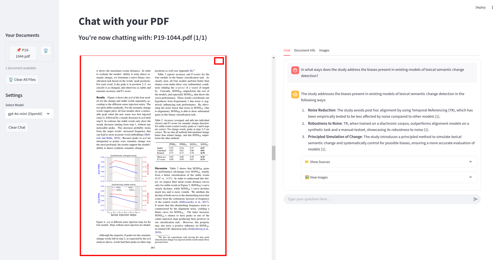

# Chat with PDFs

A Streamlit application that allows users to upload PDF documents and chat with them using LLM technology.



## Overview

Chat with PDFs processes PDF documents with LlamaIndex and generates responses using various language models. The application features a user-friendly interface for document management, chat history, and document visualization.

## Features

- **Document Processing**: Upload and process single or multiple PDF documents
- **Chat Interface**: Natural language interaction with document content
- **Citation Support**: Responses include citations to specific parts of the document
- **PDF Viewer**: View documents with highlighted citations
- **Image Extraction**: Automatically extracts and displays images from documents
- **Multi-Document Support**: Switch between multiple uploaded documents
- **Multi-Provider Support**: Works with OpenAI, Ollama, and custom OpenAI-compatible API providers
- **Model Selection**: Choose from different language models with provider-specific configurations

## Project Structure

The application follows a modular architecture for better maintainability and extensibility:

```
chat-with-docs/
├── app.py                    # Main application
├── assets/img                # Static assets (images)
├── src/
│   ├── core/                 # Business logic
│   │   ├── __init__.py
│   │   ├── document_manager.py
│   │   ├── chat_engine.py
│   │   ├── state_manager.py
│   │   └── file_processor.py
│   ├── ui/                   # UI-related components
│   │   ├── __init__.py
│   │   ├── components.py
│   │   ├── layouts.py
│   │   └── handlers.py
│   ├── utils/                # Utility functions
│   │   ├── __init__.py
│   │   ├── common.py
│   │   ├── source.py
│   │   ├── image.py
│   │   └── logger.py
│   ├── config.py             # Configuration settings
│   ├── custom_retriever.py   # Custom retrieval logic
│   └── __init__.py
```

## Getting Started

### Prerequisites

- Python 3.9+
- OpenAI API key or other LLM provider credentials

### Installation

1. Clone the repository:
```bash
git clone https://github.com/yourusername/chat-with-docs.git
cd chat-with-docs
```

2. Install the required packages:
```bash
pip install -r requirements.txt
```

3. Create a `.env` file with your API keys and configuration:
```
# Required for OpenAI models
OPENAI_API_KEY=your_api_key_here

# Optional: Logging level
LOG_LEVEL=INFO  # DEBUG, INFO, WARNING, ERROR

# Optional: For Ollama integration
OLLAMA_ENDPOINT=http://localhost:11434
OLLAMA_MODELS=llama3,gemma,mistral  # Comma-separated list of models

# Optional: For custom OpenAI-compatible providers
CUSTOM_API_ENDPOINT=https://your-custom-endpoint.com/v1
CUSTOM_API_KEY=your_custom_api_key
CUSTOM_MODELS=model1,model2  # Comma-separated list of custom models
CUSTOM_SUFFIX=(Custom)  # Display suffix for UI

# Optional: Model display names
OPENAI_SUFFIX=(OpenAI)  # Display suffix for OpenAI models
OLLAMA_SUFFIX=(Ollama)  # Display suffix for Ollama models

# Optional: Default summary model
SUMMARY_MODEL=gpt-4o-mini  # Model to use for document summarization
```

### Running the Application

Run the application with Streamlit:

```bash
streamlit run app.py
```

## Usage

1. Upload one or several PDF documents using the sidebar upload button
2. Wait for the document(s) to be processed
3. Ask questions about the document in the chat input
4. View responses with citations and annotations to the source material
6. Switch between different language models using the dropdown in the sidebar
## TODO

- Custom size of chunks
- Chat with all the PDFs
- Allow users to refer to images if the model supports vision


## Authors

virtUOS